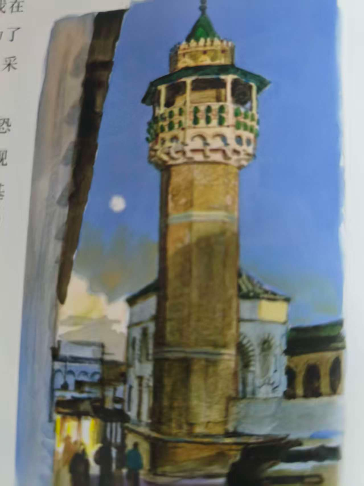
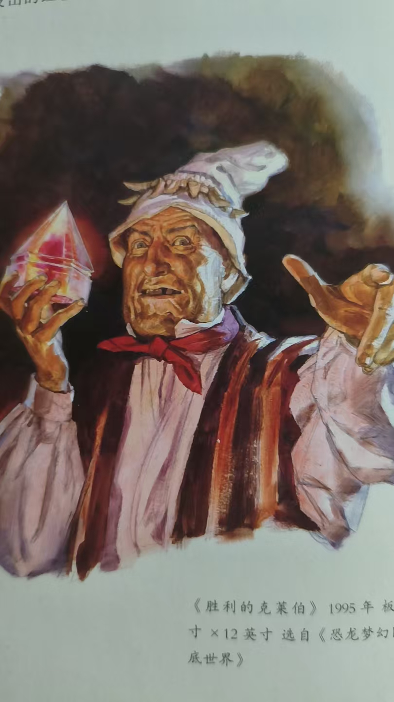
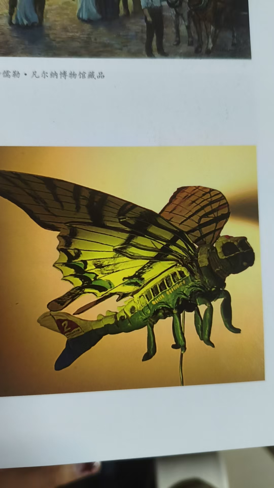
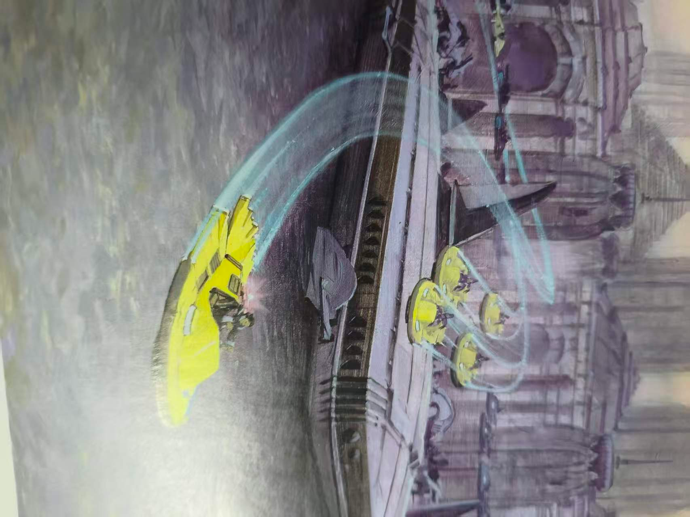
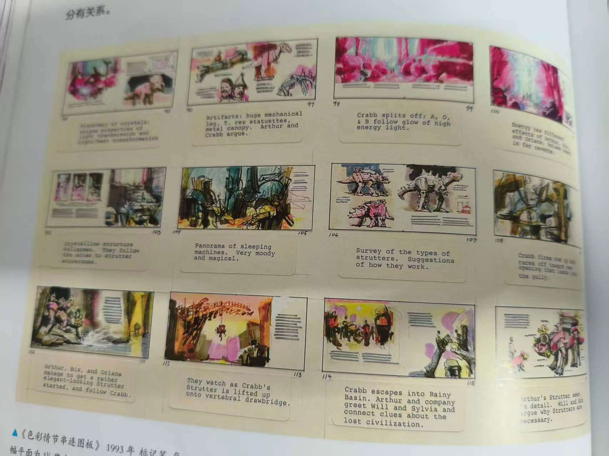
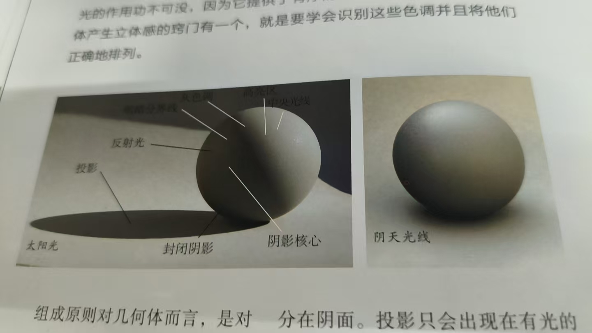

d
# 色彩与光线

> **96** 个文本节点 · **24** 个分组 · **110** 条连线

## 直射阳光
  - 蓝天光（散射）+反射光
    - 从窗户照射进来的光
      - **非直射（天空光与反射光）**
        - 硬
        - 与室内光进行对比
      - **非直射（天空光与反射光）**
        - 软
  - **阴天**
    - 对比弱，饱和度较高，明度整体差异小
  - **明媚**
    - 对比感强，明度差异大

## 生物发光
### 自身产出可见光

## 荧光
### 将不可见电磁能转换成可见光

## 隐藏在画内的光
### 区别于外光与画中的可见光
  - 吸引观众好奇心

## 隐性光
### 多由点光构成

## 半投影
### 一部分没被投影，一部分被投影

    >  *(上图引用自思维导图附件)*
      - 戏剧感

## 四分之三光
### 人物正脸的1/4阴影，3/4光区
  - **子集：伦勃朗光**
    - 鼻子的投影与脸颊的阴影重合
      - 伦勃朗三角：宽度小于眼睛宽度，高度小于鼻子长度
        - 神秘与叙事（通过阴影此类被削减信息的部分展现）

## 对空光（逆光）
### 光源的范围很大（感觉把物体笼罩起来了，直接充当背景）

## 边缘光（Kicker）
### 通常由直射光形成
  - **通过与明度较暗（比较）的背景进行明暗对比突出物体**

    >  *(上图引用自思维导图附件)*

## 与现实中熟悉的灯光习惯相违背

## 通过光的引导与延申

## 色彩本身
### 渐变色
### 灰色与素色
    - 有效突出纯度较高的颜色
### 增添明度变化与色相变化
### 绿色问题
#### 绿色的纯度越高优先级越低

## 色彩间关系
### 色彩间的关系
    - 单色
      - 黑白灰（有时会有颜色倾向）
    - 暖色调与冷色调
      - 以黄色与蓝色色相为区分
        - 互相突出强调或对比
    - 有色光混合(Add)
    - 强调色
      - 与背景互为互补色

        >  *(上图引用自思维导图附件)*
      - 高纯度（相对）

## 色域
### 主观中性色（多边形中心）
    - 因为白平衡被转变为灰色（相对无颜色倾向）
      - 在时间或空间的转变下
        - **设置颜色脚本（画面场景的主观原基色定调）**

          >  *(上图引用自思维导图附件)*
### 主观原基色（多边形顶点）
### 色域蒙版
#### 多边形
### 色域控制
#### 画面中的颜色几何在色盘中的对应
      - 我们需要控制色域的大小

## 点光衰减（平方反比定律）
  - 烛光与火光
  - 发光
  - 室内电灯光

## 理性分类
  - 月光
    - 与人为光做对比

## 视锥细胞（分辨颜色）
  - 光强较低时几乎失效

## 光源

## 视杆细胞（分辨色调（明度））
  - 对黑暗敏感，且对蓝绿色敏感

## 理论基础（普肯野效应）

## 明度降低

## 月光与夜晚环境
  - 现象
    - 色相偏移（蓝绿色）

## 维持其存在使其更生动

## 阴影核心

## 视觉感知
  - 景深
    - 理论基础(人眼景深)
      - Z轴景深+xy平面（视心）景深
  - 中性色的相对改变
    - 理论基础
      - 人眼白平衡
      - 视觉残影
    - 现象
      - 在冷光的影响下，原本应该为中性色的地方会显得暖色（相反也成立）

## 色彩与光线
  - 光与物体
    - 对光影组成的新理解
      - 弥漫光（仅环境光或+微弱直射光）
        - 光区模糊（感觉都有光只不过强弱之分）
    - 注意光影对色相（色调）的影响
    - 影
      - 投影
        - 投影的规律
          - 强光产生硬投影，软光软投影（非绝对）
          - 离被投影物越远越软
        - 投影艺术表达
      - 封闭阴影
    - 光
      - 正面光
      - 下面光源
        - 诡异陌生感
        - 生活感
          - 取材于生活中的印象（比如照着灯看书，被书反光到人脸）
        - 巨大感
  - 颜色

## 反射光
  - 直射光打在其他物体上重新成为一个光源

## 聚光灯
  - 光的引导与暗示
