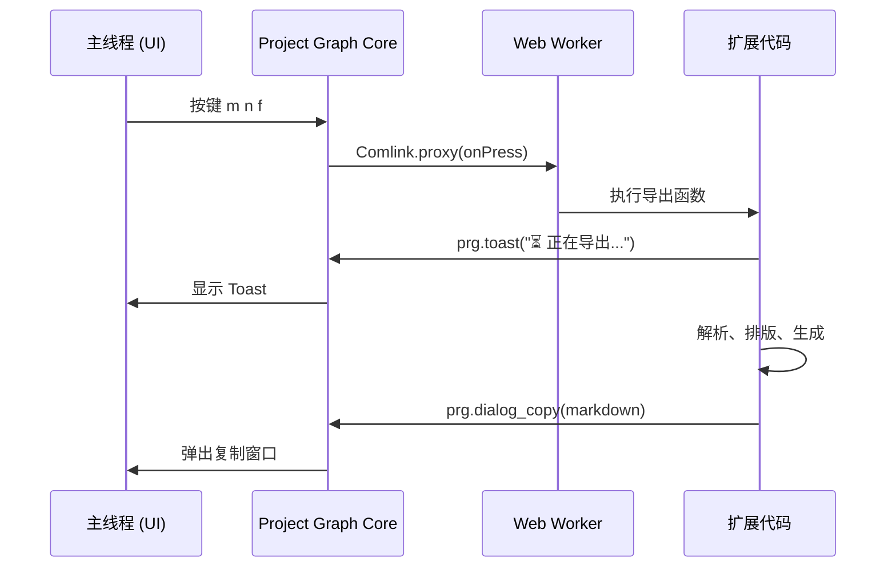

# Project Graph 扩展开发 

> 将 `.prg` 工程文件导出为 Markdown（含内嵌图片），零外部依赖

---

## 一、扩展架构：Web Worker + Comlink 多线程

### 1.1 为什么需要多线程

Project Graph 使用 **Web Worker** 运行扩展代码，通过 **Comlink** 实现主线程与 Worker 之间的 RPC 通信。这意味着：

- 扩展代码运行在独立线程，不会阻塞主 UI 线程
- 数据传递需要经过序列化/反序列化（结构化克隆）
- 某些原生类型（如 `Map`、`Blob`）无法直接跨线程传递



### 1.2 Comlink 的限制

通过 Comlink 代理访问 Project Graph API 时，存在以下关键限制：

| 操作 | 是否可行 | 原因 |
|------|---------|------|
| 访问 `project.attachments`（`Map<string,Blob>`） | ❌ | Map/Blob 无法跨线程代理 |
| `fetch_binary("file://...")` | ❌ | 不支持 `file://` 协议 |
| `settings_getGlobal("globalMenuConfig")` | ❌ | 扩展无权读取全局菜单配置 |
| 回调中使用 `.find()`/`.some()` | ❌ | 回调函数无法跨线程 |

这些限制直接决定了我们的数据获取方案。

---

## 二、数据获取：零外部依赖的纯 JS 方案

### 2.1 方案演进

| 阶段 | 方案 | 问题 |
|------|------|------|
| v1 | 通过 Comlink 直接读取 `project.attachments` | Map 跨线程不可用 |
| v2 | `fetch_binary` 读取本地文件 | 不支持 `file://` |
| v3 | Python `shell_execute` 解析 msgpack + 提取图片 | 依赖 Python 环境 |
| **v4** | **PowerShell 读文件 → JSZip + msgpack** | ✅ 零外部依赖 |

### 2.2 最终方案

```
PowerShell: .prg 文件 → base64 字符串 (纯文本，无二进制损坏)
    ↓
JavaScript: atob → Uint8Array
    ↓
JSZip: 解压 ZIP
    ↓
@msgpack/msgpack: 解析 stage.msgpack
    ↓
JS: 遍历 attachments/ → base64 Data URI
```

```typescript
// PowerShell 只做一件事：读文件转 base64
const psCmd = `[Convert]::ToBase64String([IO.File]::ReadAllBytes('${prgPath}'))`;
const { stdout } = await prg.shell_execute("powershell", ["-NoProfile", "-Command", psCmd]);

// JS 侧完成所有解析
const zipData = Uint8Array.from(atob(stdout.trim()), (c) => c.charCodeAt(0));
const zip = await JSZip.loadAsync(zipData);
const stageBytes = await zip.file("stage.msgpack").async("uint8array");
const stageData = msgpackDecode(stageBytes);
```

### 2.3 大文件 base64 编码

直接 `btoa(String.fromCharCode(...bytes))` 对大图片会爆栈。改为 32KB 分块：

```typescript
function uint8ToBase64(bytes: Uint8Array): string {
  const CHUNK = 0x8000; // 32KB
  let result = "";
  for (let i = 0; i < bytes.length; i += CHUNK) {
    result += String.fromCharCode.apply(null, bytes.subarray(i, i + CHUNK));
  }
  return btoa(result);
}
```

---

## 三、数据模型：两类关系 + 递归提取

### 3.1 Project Graph 的继承体系

通过阅读源码 (`app/src/core/stage/stageObject/`)，确认了完整的数据模型：

```
StageObject
├── Association (associationList: StageObject[])
│   ├── ConnectableAssociation (associationList: ConnectableEntity[])
│   │   ├── Edge (source=[0], target=[1])
│   │   │   ├── LineEdge
│   │   │   ├── ArcEdge
│   │   │   └── CubicCatmullRomSplineEdge
│   │   └── MultiTargetUndirectedEdge
│   └── SyncAssociation
└── Entity
    └── ConnectableEntity
        ├── Section (children: Entity[])
        ├── TextNode
        ├── ImageNode
        └── ...
```

### 3.2 两类核心关系

| 关系类型 | 数据来源 | 语义 |
|---------|---------|------|
| **包含** | `Section.children` | 父子层级（框内嵌套） |
| **连接** | `Edge.associationList` | 节点间连线（可带标签） |

### 3.3 内嵌节点的递归提取

边的 `associationList` 中可能存在内嵌的 Section 对象（含子节点），这些对象**不在顶层数组中**，需要递归遍历：

```
LineEdge
  associationList:
    [0]: {$: "/78"}                    ← source ref
    [1]: {                             ← 内嵌 Section！
      _: "Section"
      text: "半投影"
      children:
        [0]: TextNode "一部分没被投影..."
        [1]: ImageNode
        [2]: TextNode "戏剧感"
    }
```

**递归收集逻辑：**

```typescript
function collectNestedNodes(root: unknown[], existingNodes: Map<string, RawNode>): void {
  function walk(obj: unknown): void {
    // 遍历所有属性中的数组和对象
    for (const key of Object.keys(record)) {
      const val = record[key];
      if (Array.isArray(val)) {
        for (const item of val) walk(item);  // 递归进入
      }
    }
  }
}
```

---

## 四、排版引擎：双模式渲染

### 4.1 设计原则

两类关系对应两种 Markdown 表现：

| 关系 | Markdown | 示例 |
|------|---------|------|
| Section 包含 | `#` 标题层级 | `## 影` → `### 投影` → `#### 投影艺术表达` |
| Edge 连接 | `-` 缩进列表 | `  - **半投影**` → `    - 一部分没被投影...` |

### 4.2 关键去重逻辑

**边标签与目标节点同名 → 跳过 `> ` 行：**

```typescript
// 边标签 "半投影" == Section.text "半投影" → 不重复显示
if (edgeText && edgeText !== targetText) {
  lines.push(`${indent}  > 💬 *${edgeText}*`);
}
```

**仅通过边可达的节点 → 排除出顶层：**

```typescript
// edgeOnly: 是边 target 但不在任何 Section.children 中 → 不作为顶层
const edgeOnlyNodes = new Set<string>();
for (const uuid of edgeTargetSet) {
  if (!childToParent.has(uuid)) edgeOnlyNodes.add(uuid);
}
const topLevel = [...nodes.keys()]
  .filter(uuid => !childToParent.has(uuid) && !edgeOnlyNodes.has(uuid));
```

### 4.3 渲染模式切换

```typescript
function writeNodeContent(uuid: string, indent: string, asHeading: boolean, depth: number): void {
  if (asHeading) {
    // 包含关系 → # 标题
    lines.push(`${"#".repeat(depth + 2)} ${text}`);
  } else {
    // 连接关系 → - 列表
    lines.push(`${indent}- **${text}**`);
  }
  // 先渲染 children（包含），再渲染 edge targets（连接）
}
```

---

## 五、快捷键系统与事件处理

### 5.1 注册流程

```typescript
await prg.keybinds_register(
  "prgToMarkdownClipboard",
  { $lucide: "FileText" },
  "m n f",                            // 默认三键和弦
  Comlink.proxy(async () => { ... }),  // Comlink 代理到 Worker
);
```

快捷键配置持久化在 `%APPDATA%/liren.project-graph/keybinds2.json`，修改 `defaultKey` 后需清除缓存或手动在设置页更改。

### 5.2 和弦 vs 修饰键

| 类型 | 示例 | 优点 | 缺点 |
|------|------|------|------|
| 和弦（Chord） | `m n f` | 易记、无修饰键冲突 | 末键可能触发画布单键绑定 |
| 修饰键 | `Ctrl+Shift+M` | 不触发单键 | 可能与系统快捷键冲突 |

最初使用 `m d s`，但 `s` 键在 Project Graph 画布层有独立处理（`event.preventDefault()` 只阻止浏览器默认行为，不影响画布层监听器），导致导出完成后 `s` 被重复处理。最终改用 `m n f`。

### 5.3 事件流分析

```
keydown(s) → enqueue → check() → 匹配 "m n f" 和弦
    ↓
onPress() → Comlink → Worker 执行导出
    ↓
event.preventDefault() ← 阻止浏览器打字
    ↓ (画布层独立监听，不受影响)
canvas.onKeyDown(s) → 如果 s 有画布绑定 → 会触发
```

---

## 六、进度反馈 UX

### 6.1 Toast 阶段链

扩展运行在 Worker 线程，不能直接操作 DOM。通过 `prg.toast()` 向主线程发送通知：

```
m n f → ⏳ 正在导出 Markdown...        ← 立即反馈
      → ⏳ 正在准备导出...
      → ⏳ 正在解析项目文件...           ← PowerShell 读文件
      → ⏳ 已提取 120 节点 · 110 连线    ← 含统计数据
      → [弹窗：预览 + 复制]
      → ✅ 已复制 · 120 节点 · 110 连线
```

### 6.2 设计要点

- **首帧反馈**：keybind handler 第一行就是 `toast()`，确保用户立即看到响应
- **阶段统计**：解析完成后立即显示节点/连线数，让用户感知进度
- **最终确认**：`dialog_copy` 弹窗提供预览 + 一键复制，`toast_success` 给出摘要

---

## 七、总结

| 维度 | 方案 |
|------|------|
| 运行时 | Web Worker + Comlink 代理 |
| 数据获取 | PowerShell base64 → JSZip → msgpack |
| 节点提取 | 顶层扫描 + 递归遍历 associationList/children |
| 排版 | 包含 → `#` 标题；连接 → `-` 列表 |
| 边标签 | associationList 内嵌对象中的 text/details/name 字段 |
| 图片 | 32KB 分块 base64 编码，引用式嵌入 |
| 快捷键 | 三键和弦 `m n f`，持久化于 keybinds2.json |
| 依赖 | 零外部依赖（JSZip + msgpack 随扩展打包） |
