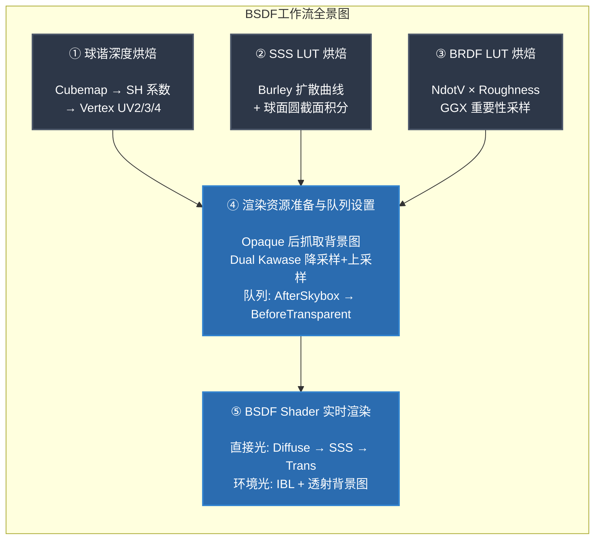

# BSDF 材质工作流

## 概述




## 一、球谐深度烘焙（Cubemap → SH → 顶点信息）

### 1.1 原理

对于每个顶点，从该顶点位置向所有方向发射射线，记录射线在模型内部穿行的距离（即厚度）。这本质上是一个 **6 面 Cubemap 深度图** 的采集过程。为了将 Cubemap 压缩为可存储在顶点中的数据，使用 **3 阶球谐函数（9 个系数）** 进行投影。

SH 投影公式：
$$c_l = \int_{\Omega} f(\omega) \cdot Y_l(\omega) \, d\omega$$

### 1.2 烘焙流程

```
For each vertex:
  1. 将顶点置于统一 10m 烘焙沙盒中（scaleFactor = 10 / maxDim）
  2. 相机放到顶点位置 + 沿法线向内偏移
  3. 使用 Cull Front 的 Thickness Shader 渲染到 128×128 Cubemap
     - 剔除正面 → 相机在模型内部看到对面的内壁
     - 输出: distance 
  4. 求解球谐投影系数
  5. 解码: 系数 × (scaleFactor) → 恢复模型空间真实厚度
  6. 存储到 UV2, UV3, UV4 通道
```


### 1.3 GPU 投影Kernel


```
For each coefficient (0~8):
  1. 6 个 cubemap face × 分辨率 → 3D Texture2DArray
  2. 每个像素: color × SH_Basis(dir) × DifferentialSolidAngle
  3. 线程组中使用groupshared（共享内存）+ GroupMemoryBarrierWithGroupSync()进行线程组内的归并求和（对折算法）->pingpongBuffer，每次根据线程组求和的尺寸进行缩减.
  4. 输出单精度 float4 到 coefficients buffer
```
![[Pasted image 20260811181606.png|693]]


![[Pasted image 20260811182029.png]]


---

## 二、SSS LUT 烘焙（平面圆扩散积分）

### 2.1 原理

SSS LUT 用于快速查询在给定 **光照角度（NdotL）** 和 **表面曲率** 下，次表面散射的出射强度。

核心模型：**Burley Normalized Diffusion**（迪士尼标准散射曲线）：
$$R(r, d) = \frac{e^{-r/d} + e^{-r/(3d)}}{8\pi \cdot d \cdot r}$$

其中 $r$ 是表面两点间的距离，$d$ 是散射距离。

### 2.2 积分方法：1D 圆环截面积分

```
LUT 布局: 128×128
  X 轴 (0→127): NdotL ∈ [-1, 1]  → 光照方向与表面法线的夹角
  Y 轴 (0→127): curvature ∈ [0.005, 2.0] → 表面曲率（半径 = 1/curvature）

积分步骤:
  1. 将曲率转为球面半径 R = 1 / curvature
	  1. 对于每个角度 θ ∈ [-π, π]（720 步）:
     a. 计算弦长 chord = 2R · sin(|θ| / 2)
     b. 计算扩散权重 weight = Burley(chord, d=1.0)
     c. 只有 cos(θ - α) > 0 的被照面才有贡献
     d. 累加: result += cos(θ - α) × weight
  3. 归一化: result / totalWeight
```
![[Pasted image 20260811232051.png]]
>**设计思想**：只烘焙物理基准距离 `d=1.0` 的单通道灰度 LUT。运行时在 Shader 中对 RGB 三通道分别采样：`curvature × ScatterRadius.rgb × ScatterScale`，实现免重复烘焙的万能体积散射。**缺点：原本对于ScatterRadius.rgb × ScatterScale并不应是线性关系**


---

## 三、BRDF LUT 烘焙（NdotV × Roughness）

### 3.1 原理

BRDF LUT 为 IBL（Image-Based Lighting）的环境高光提供预计算的 **Fresnel Scale** 和 **Fresnel Bias**。

LUT 布局：
- **横轴（X）**: $N \cdot V$（法线与视线夹角余弦）∈ [0, 1]
- **纵轴（Y）**: Roughness ∈ [0, 1]

### 3.2 计算方法：蒙特卡洛积分 + GGX 重要性采样

```hlsl
// Split-Sum Approximation 的第二项:
// ∫_Ω f_r(p, ω_i, ω_o) · (ω_i · n) dω_i

for each sample (Hammersley 低差异序列, 1024 次):
  1. 用 GGX 重要性采样生成半向量 H
  2. 反射得到光照方向 L = 2(V·H)H - V
  3. 计算几何遮蔽 G = G_SchlickGGX(N·V) × G_SchlickGGX(N·L)
  4. 计算权重 G_Vis = G × (V·H) / ((N·H) × (N·V))(除以概率密度得出)
  5. Fresnel: Fc = (1 - V·H)^5
  6. 累加:
     scale += (1 - Fc) × G_Vis    // F0 的系数
     bias  += Fc × G_Vis          // 常数偏移

最终存储: RG = (scale/1024, bias/1024)
```

运行时重建 IBL 高光：
```hlsl
float3 indirectSpecular = Envmap.Sample(rv, roughness_mip)
                        * (F0 * BRDF_LUT.r + BRDF_LUT.g);
```

---

## 四、渲染资源准备与队列设置

### 4.1 整体管线时序

```
渲染顺序:
  Opaque Geometry          ← 场景不透明物体
       ↓
  [抓取背景图]             ← AfterRenderingOpaques + 1
       ↓
  Kawase Downsample        ← 多次降采样（模糊扩散）
       ↓
  Kawase Upsample          ← 逐步升采样回原分辨率
       ↓
  [设置全局 RT]            ← _TransmittanceSharpRT & _TransmittanceBlurRT
       ↓
  Skybox                   ← 天空盒
       ↓
  Transmittance Queue      ← BSDF 材质渲染（LightMode = "Transmittance"）
       ↓
  Transparent Geometry     ← 普通半透明物体
```

### 4.2 Dual Kawase 模糊

Kawase 模糊是一种高效的近似高斯模糊，通过对角线采样实现大半径模糊。

```
降采样链（Pass 0）:
  每级: 采样 4 个对角像素求平均，分辨率减半

升采样链（Pass 1）:
  每级: 采样 4 个对角像素求平均，分辨率翻倍

最终输出:
  _TransmittanceSharpRT = 原图（清晰参考）
  _TransmittanceBlurRT  = Kawase 模糊结果（散射背景）
```

**参数控制**：
- `blurIterations`：模糊迭代次数（1~4），越大越模糊
- `blurOffset`：采样偏移量（0.5~3.0），控制模糊扩散半径

### 4.3 相关文件

| 文件 | 作用 |
|------|------|
| `Scripts/TransmittanceObjectDrawFeature.cs` | URP RendererFeature，管理整个渲染 Pass |
| `Resources/Shaders/KawaseBlur.shader` | Kawase 降采样/升采样 Shader |

### 4.4 TransmittanceObjectDrawFeature 关键代码解析

```csharp
// 1. 抓取背景原图
Blitter.BlitCameraTexture(cmd, cameraColorTarget, m_sharpCameraRT);
cmd.SetGlobalTexture("_TransmittanceSharpRT", m_sharpCameraRT);

// 2. Kawase 降采样
for (int i = 0; i < blurIterations; i++)
    Blitter.BlitCameraTexture(cmd, currentSource, m_tempRTs[i], m_blurMaterial, 0);

// 3. Kawase 升采样
for (int i = blurIterations - 2; i >= 0; i--)
    Blitter.BlitCameraTexture(cmd, currentSource, m_tempRTs[i + MAX_ITERATIONS], m_blurMaterial, 1);

// 4. 发布模糊结果
cmd.SetGlobalTexture("_TransmittanceBlurRT", m_finalBlurRT);

// 5. 绘制 Transmittance 队列（LightMode = "Transmittance"）
cmd.DrawRendererList(rendererList);
```

---

## 五、BSDF Shader 编写

### 5.1 Shader 整体结构

```
BSDF.shader
├── Properties (材质参数)
├── SubShader / Pass "Transmittance"
│   ├── Vertex Shader
│   │   ├── 标准空间变换
│   │   └── 解包 SH 系数 (UV2/3/4 → sh_0, sh_1, sh8, curvature)
│   └── Fragment Shader
│       ├── 采样贴图 (BaseMap, MetallicGloss, Occlusion, Normal)
│       ├── [厚度重建] V 方向厚度 + 折射偏移
│       ├── [体积衰减] TransmittanceColor + TransmittanceDistance
│       ├── [直接光] ── 分解为三层 ──
│       │   ├── Specular (GGX BRDF)
│       │   ├── SSS Diffuse (Burley LUT 查表)
│       │   └── Single Scattering (相位函数 + 体积衰减)
│       └── [环境光] ── 分解为三层 ──
│           ├── Indirect Diffuse (Light Probes / SH)
│           ├── Indirect Specular (Envmap + BRDF LUT)
│           └── Indirect Transmission (背景图混合)
```

### 5.2 厚度重建

```hlsl
// 1. 将世界空间视线方向转为模型空间
float3 V_OS = TransformWorldToObjectDir(V);

// 2. 用视线反方向采样 SH 基函数
float4 sh0 = float4(Y0(-V_OS), Y1(-V_OS), Y2(-V_OS), Y3(-V_OS));
float4 sh1 = float4(Y4(-V_OS), Y5(-V_OS), Y6(-V_OS), Y7(-V_OS));

// 3. 点积重建该方向上的模型空间厚度
float thickness_V_OS = max(0, dot(sh0, input.sh_0)
                           + dot(sh1, input.sh_1)
                           + Y8(-V_OS) * input.sh8);

// 4. 恢复到世界物理尺度
float thickness = thickness_V_OS * worldScale;
```

### 5.3 直接光分解

#### 5.3.1 高光（Specular）— Cook-Torrance GGX

```hlsl
float D = D_GGX(NdotH, roughness);        // 法线分布
float G = G_Smith(NdotV, NdotL, roughness); // 几何遮蔽
float3 F = F_Schlick(VdotH, F0);           // Fresnel

float3 specular = (D * G * F) / max(4 * NdotV * NdotL, 0.001) * NdotL;
```

#### 5.3.2 次表面散射（SSS）→ 替代漫反射

SSS 是传统 Lambert 漫反射的高级替代：

```hlsl
// 1. 构建 LUT 采样坐标
float sndl = rawNdotL * 0.5 + 0.5;          // 映射到 [0,1]
float baseCurvature = saturate(abs(curvature));

// 2. 三通道独立采样（不同散射距离 → 不同颜色）
float3 scatterDist = max(ScatterRadiusRGB * ScatterScale, 0.001);
float3 curvRGB = saturate(baseCurvature * scatterDist);

float sssR = SSS_LUT.Sample(float2(sndl, curvRGB.r)).r;
float sssG = SSS_LUT.Sample(float2(sndl, curvRGB.g)).r;
float sssB = SSS_LUT.Sample(float2(sndl, curvRGB.b)).r;

// 3. 计算逆光透射（Thickness SSS）
float3 thinness = exp(-thickness_L / scatterDist);
float3 thicknessSSS = thinness * albedo / π * ThicknessSSSIntensity;

// 4. 混合
float3 sssDiffuse = sssEfficiency * albedo / π
                  + thicknessSSS * saturate(1.0 - rawNdotL);
```

**参数说明**：

| 参数 | 作用 |
|------|------|
| `_ScatterRadiusRGB` | RGB 三通道散射半径（控制色彩分离程度） |
| `_ScatterScale` | 全局散射缩放（0.01~1000） |
| `_SSSIntensity` | Lambert → SSS 混合系数（0 = 纯漫反射） |
| `_ThicknessSSSIntensity` | 逆光厚度透射强度 |

#### 5.3.3 单次散射透射（Single Scattering Transmission）

```hlsl
// 相位函数（Henyey-Greenstein）
float phase = HG_Phase(dot(L, V), _Anisotropy);

// 体积衰减
float3 volumeAttenuation = pow(_TransmittanceColor, thickness / _TransmittanceDistance);

// 透射贡献
float3 singleScatter = phase * volumeAttenuation * lightColor * attenuation * shadow;

directTransmission = singleScatter * _Transmission * kD_direct;
```

**参数说明**：

| 参数 | 作用 |
|------|------|
| `_Transmission` | 全局透射强度（0~1），同时剥离漫反射能量 |
| `_IOR` | 折射率（1~2.5），影响折射偏移 |
| `_ThicknessDistort` | 折射偏移强度（0~1） |
| `_TransmittanceColor` | 体积透射颜色（Beer-Lambert 衰减基准色） |
| `_TransmittanceDistance` | 透射衰减距离 |
| `_Anisotropy` | 相位函数各向异性（-1 后向 ~ +1 前向） |

### 5.4 环境光分解

#### 5.4.1 间接漫反射

```hlsl
float3 indirectDiffuse = SampleSH(N) * albedo * (1 - metallic);
```

#### 5.4.2 间接高光（IBL）

```hlsl
float2 brdfUV = float2(NdotV, roughness);
float2 preBRDF = BRDF_LUT.Sample(brdfUV).xy;

float3 indirectSpecular = Envmap.SampleLevel(rv, roughness * 7).rgb
                        * (F0 * preBRDF.x + preBRDF.y);
```

#### 5.4.3 间接透射（背景图可视度）

通过 `_Transmission` 在间接漫反射和背景透射之间过渡：

```hlsl
// 背景图模糊度由厚度控制
float3 transmittanceColor = lerp(sharpRT, blurRT,
    saturate(pow(thickness, _ThicknessPower) / 2.0) * (1 - _TransmittanceSmoothness));

// 体积衰减
float3 volumeAttenuation = pow(_TransmittanceColor, thickness / _TransmittanceDistance);

float3 indirectSpecTrans = kD_Trans * transmittanceColor * volumeAttenuation;

// 过渡
float3 indirectColor = lerp(indirectDiffuse, indirectSpecTrans, _Transmission)
                     + indirectSpecular;
```

**参数说明**：

| 参数 | 作用 |
|------|------|
| `_ThicknessPower` | 厚度对模糊度的非线性控制（0.1~5） |
| `_TransmittanceSmoothness` | 透射背景清晰度（0 = 纯模糊 ~ 1 = 纯清晰） |

### 5.5 能量守恒架构

```
最终颜色 = (直接光高光 + 直接光漫反射) × Occlusion
         + 直接透射 × Occlusion
         + 间接光（漫反射↔透射 lerp + 高光）

其中:
  直接光漫反射 = lerp(Lambert × kD, SSS_Diffuse × (1-metallic), _SSSIntensity)
               × (1 - _Transmission)   ← 透射从漫反射中剥走能量

  间接光 = lerp(SH Diffuse, Transmission_Background, _Transmission) + IBL Specular
```

---

