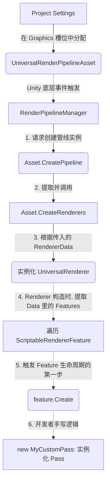
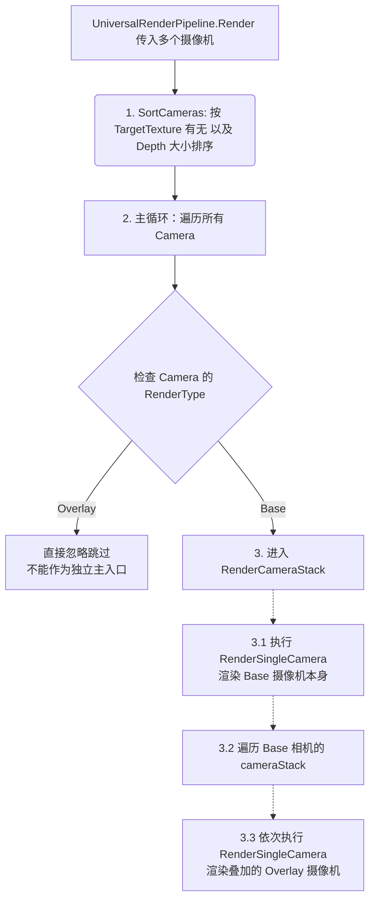
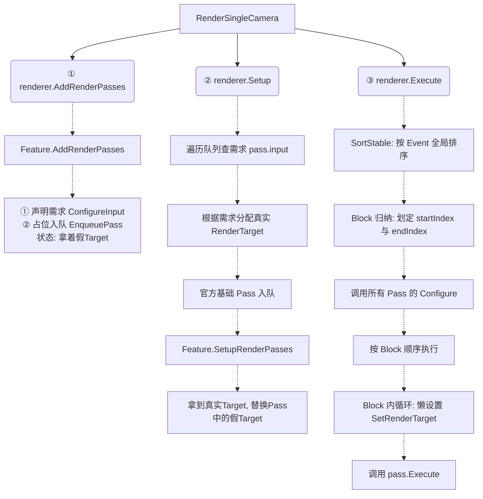

# Unity SRP渲染管线的设计解析

> 目的为对 SRP 的框架进行理解，理解其 ***必要的部分与原理***，并非对非必要细节进行逐词翻译。

---

## 一、SRP 渲染管线与 Unity 底层调用渲染指令的联系

![[Pasted image 20260729210632.png|697]]

---

## 二、RenderPipelineAsset

### 1.1 成员

#### 1.1.1 虚拟成员
##### 属性 (get; set;)
- `defaultMaterial` (在编辑器中物体的默认 material)
- `defaultShader` (在编辑器中物体的默认 shader)
- `renderPipelineShaderTag` (对应于 shaderlab 的 renderpipline tag)
- ...

##### 方法
- `OnValidate()` (在编辑器中修改参数时调用)
- ...

#### 1.1.2 抽象成员
##### 方法
- **`CreatePipeline(this)` (实例化 RenderPipeline)**

---

## 三、RenderPipeline

#### 关键方法
- **`RenderInternal(context, cameras)`** (调用 Render)
- **`Render(context, cameras)`** (abstract)

> 以上为 SRP 的最基础的架构，即使没有 URP 对于 Renderer、Pass、RendererFeature 的抽象，依然可以通过直接对 context 进行指令填充，实现简单的渲染管线。
>
> **渲染基础流程：**
> - `RenderPipeline.Render(context, cameras[])`
>   ↓
>   - [逐相机循环]
>     ↓
>     - `context.SetupCameraProperties(camera)` ← 同步 MVP 矩阵到 GPU
>       ↓
>     - `camera.TryGetCullingParameters()` ← 准备剔除参数
>       ↓
>     - `context.Cull()` ← CPU 侧视锥体/遮挡剔除
>       ↓
>     - `cmd.ClearRenderTarget()` ← 清理 FrameBuffer
>       ↓
>     - `context.DrawRenderers()` [Opaque] ← 不透明物体渲染
>       ↓
>     - `context.DrawSkybox()` ← 天空盒渲染
>       ↓
>     - `context.DrawRenderers()` [Transparent] ← 半透明物体渲染
>       ↓
>     - `context.Submit()` ← 将 CommandBuffer 批量提交 GPU 执行

---

# URP 对 SRP 的拓展

> 目的为 URP 基于 SRP 的框架的拓展进行理解，理解其 ***必要的部分与原理***，并非对非必要细节进行逐词翻译。

---

## 一、UniversalRenderPipelineAsset

### 1.1 关键改动或新增

#### 1.1.1 成员
##### 字段
- `m_RendererDataList`
- `m_Renderers`

##### 方法
- `CreatePipeline(this)` 
  - 核心逻辑：`{ rendererdata.create() added }`
  
---

## 二、UniversalRenderPipeline

### 1.1 关键改动或新增

#### 1.1.1 成员
##### 属性
- `asset` (`pipelineAsset`)
- ...

##### 方法
- `Render(...)` 
  - 核心逻辑：`{ **sortCameras** (深度+是否渲染到 RenderTexture) -> **RenderCameraStack**(Base), for x in **Base.cameraStack，RenderSingleCamera**(x) }`
- `RenderSingleCamera(...)`
  - 核心逻辑：`{ TryGetCullingParameters -> context.Cull() -> 读取 camera.UniversalAdditionalCameraData -> 获取绑定 Renderer (从 asset 获得) -> 装配 renderingData -> renderer.AddRenderPasses (foreach features.AddRenderPasses) -> renderer.Setup(context, ref renderingData) -> renderer.Execute(context, ref renderingData) }`
- ...
  
---

## 三、ScriptableRendererData

### 1.1 成员
#### 1.1.1 正常成员
##### 属性
- `rendererFeatures` (SO)

#### 1.1.2 抽象成员
##### 方法
- **`Create(this)` (实例化 Renderer)**

---

## 四、ScriptableRenderer

### 1.1 成员
#### 1.1.1 正常成员
##### 字段
- `asset`

##### 构造方法
- `Renderer(...)`
  - 核心逻辑：`{ new xxxpass(...)..., this.asset = asset }`

##### 方法
- `Execute(...)`
  - 核心逻辑：`{ for pass in passes, pass.OnCameraSetup(...) -> context.ExecuteCommandBuffer(cmd) -> SortStable(passes) by renderpassEvent -> SetBlockRanges(设置每个 Block 包括的 passIndexRange, 一般共四个) -> for pass in passes, pass.Configure(...) -> ExecuteBlock(...) { for pass in passesInBlock, setRendererPassAttachments(...(判断并懒设置 RenderTarget)), pass.Execute(...) } four times (**BeforeRendering**，**MainRenderingOpaque**，**MainRenderingTransparent**，**AfterRendering**) -> for pass in passes, pass.OnCameraCleanup(...) }`

#### 1.1.2 抽象成员
##### 方法
- `Setup(...)`
  - 核心逻辑：`{ alloc cameraTarget from cameraData -> alloc RT and passes from passes in features configureinput + Enqueue(xxxpass) + features.SetupRenderPasses(...) }`

---

## 五、ScriptableRenderPass

### 1.1 成员

#### 1.1.1 正常成员
##### 属性
- `colorAttachments`
- `depthAttachment`
- `clearFlag`
- `clearColor`
- `renderPassEvent`
- `m_Input`
- ...

##### 方法
- `ConfigureTarget()`
- `ConfigureClear()`
- `ConfigureInput()`
  
#### 1.1.2 抽象成员
##### 方法
- `Execute(...)`

#### 1.1.3 虚拟成员
##### 方法
- `OnCameraSetup(...)`
- `Configure(...)`
- `OnCameraCleanup(...)`
- `ResetRenderTarget(...)`

---

## 六、ScriptableRendererFeature

### 1.1 成员

#### 1.1.1 抽象成员
##### 方法
- `Create(...)`
- `AddRenderPasses(...)`

#### 1.1.2 虚拟成员
##### 方法
- `SetupRenderPasses(...)`
- `Dispose(...)`
  
---

> 以上对于 URP 的 ***必要的部分与原理*** 进行了理解与分析，以下分别为实例化渲染管线与每帧渲染的精简示意图：

> ***以上为管线实例化过程***

> ***以上为在 RenderSingleCamera 之前的相机排序过程***
  

> ***以上为在 RenderSingleCamera 之后的 URP 的渲染过程***