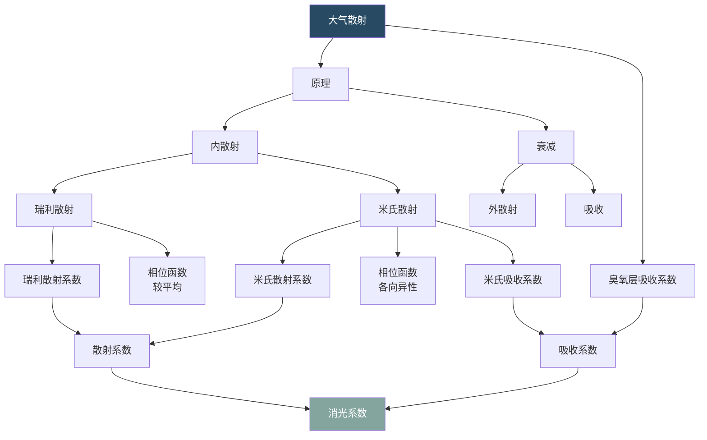
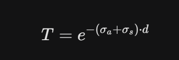

# 大气散射 - 原理拆解

> 从 Project Graph 思维导图导出 | 共 17 个节点，21 条连线

---

## 一、散射原理

大气散射描述了光线穿过大气层时，与大气中的分子和气溶胶粒子相互作用而发生方向偏转的物理过程。

### 1.1 内散射（In-Scattering）

光线在视线方向上因散射而增强的现象。

#### 瑞利散射（Rayleigh Scattering）

由大气中的小分子（如 N₂、O₂）引起，粒子尺寸远小于光的波长。

- **瑞利散射系数**：与波长 $\lambda^{-4}$ 成正比，是天空呈蓝色的原因
- **相位函数（较平均）**：瑞利散射的相位函数相对均匀，前后向散射对称

#### 米氏散射（Mie Scattering）

由较大的气溶胶粒子（如水滴、尘埃）引起，粒子尺寸与波长相当或更大。

- **米氏散射系数**：波长依赖性较低，使云呈现白色
- **相位函数（各向异性）**：前向散射占主导，形成日光周围的辉光

### 1.2 衰减（Attenuation / Out-Scattering）

光线在传播路径上因散射和吸收而减弱的综合过程。

#### 外散射（Out-Scattering）

光线被偏转出视线方向，导致能量衰减。

#### 吸收（Absorption）

光能被大气分子吸收转化为其他形式的能量。

---

## 二、消光与吸收系数

### 2.1 散射系数（Scattering Coefficient）$\beta_s$

由瑞利散射系数和米氏散射系数共同组成，描述单位距离内的散射概率。

### 2.2 吸收系数（Absorption Coefficient）$\beta_a$

由米氏吸收系数和臭氧层吸收系数组成，描述单位距离内的吸收概率。

### 2.3 消光系数（Extinction Coefficient）$\beta_e$

$$
\beta_e = \beta_s + \beta_a
$$

消光系数是散射系数和吸收系数的总和，完整描述了光线在大气中传播时的衰减。

### 2.4 臭氧层吸收系数

臭氧（O₃）在紫外波段有强吸收，对地球表面生物有重要保护作用，在大气散射计算中需要单独考虑其吸收贡献。

---

## 三、相位函数（Phase Function）

### 3.1 瑞利相位函数

$$
P_R(\theta) = \frac{3}{16\pi}(1 + \cos^2\theta)
$$

- 相对均匀，前后向对称
- $\theta$ 为入射光与散射光之间的夹角

### 3.2 米氏相位函数

- 高度前向各向异性
- 通常使用 Henyey-Greenstein 相位函数近似：

$$
P_{HG}(\theta) = \frac{1}{4\pi} \frac{1 - g^2}{(1 + g^2 - 2g\cos\theta)^{3/2}}
$$

- $g \in [-1, 1]$ 为不对称参数，$g>0$ 表示前向散射占优

---

## 四、核心关系总结

---

## 参考资料

- [Nishita et al. 1993] - Display of the Earth Taking into Account Atmospheric Scattering
- [Bruneton & Neyret 2008] - Precomputed Atmospheric Scattering
- [Hillaire 2020] - A Scalable and Production Ready Sky and Atmosphere Rendering Technique

---

## 参考图片

>以下图片从思维导图原文件中提取，为制作时的参考素材。

