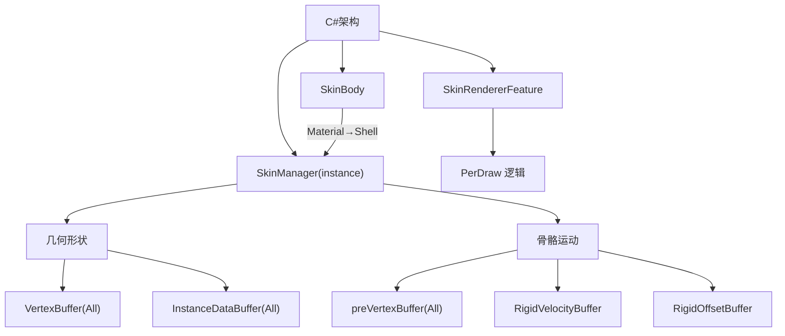
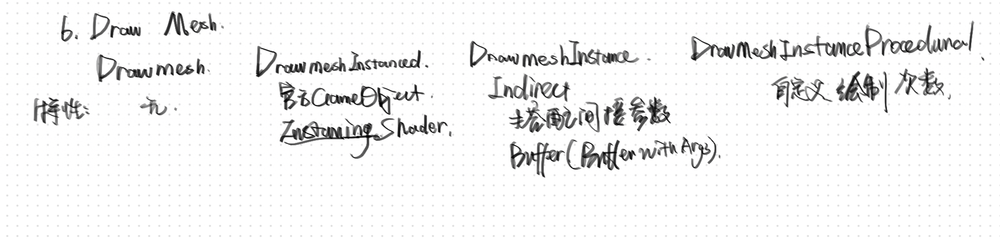
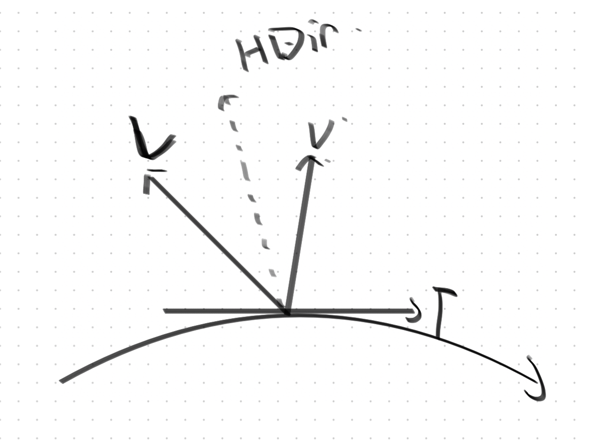
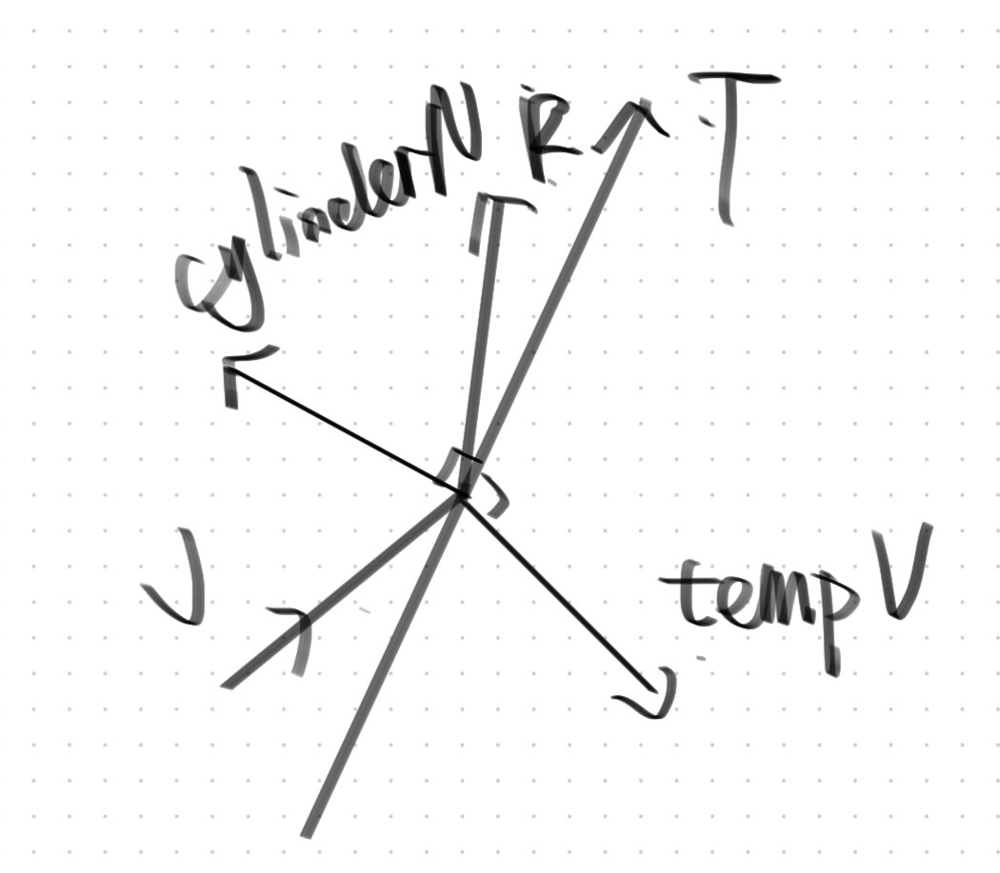
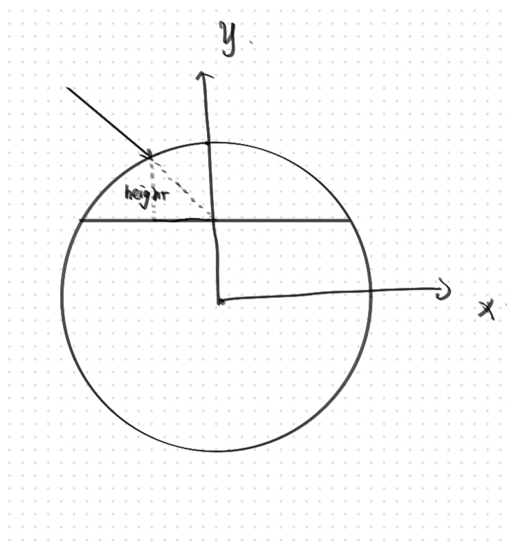
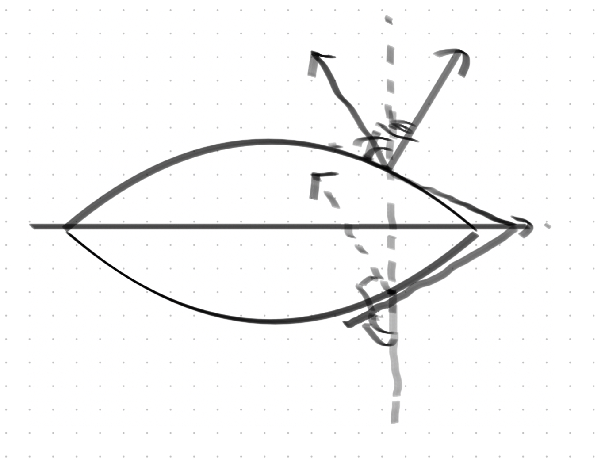
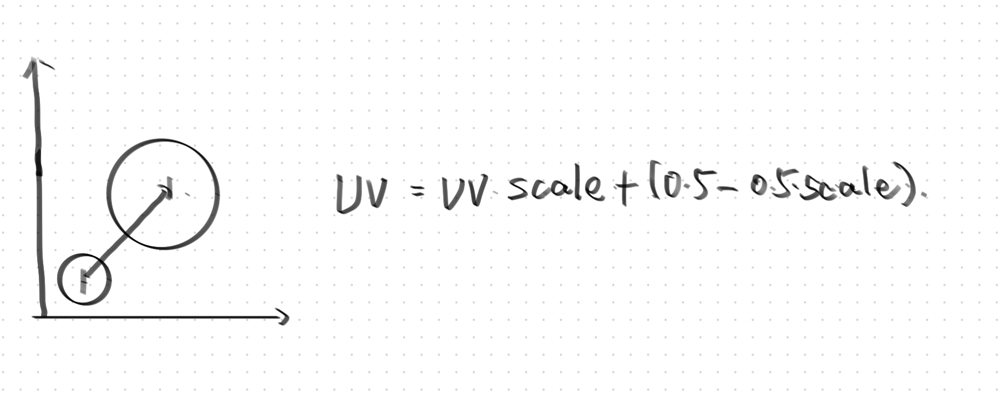
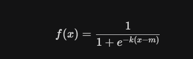

# 毛发渲染 - 完整技术拆解

> 思维导图导出 | 83 个节点 · 28 个分组 · 151 条连线

本文基于 Shell-Based Fur Rendering 技术，完整拆解从 C# 数据准备 → 顶点着色器 → 片元着色器的全管线流程。

---

## 一、应用阶段与计算阶段（C# 侧）

>数据准备、Buffer 管理和参数绑定均在 CPU 端完成。

### 1.1 C# 架构总览



### 1.2 SkinBody

皮肤主体管理，负责将材质信息传递到 Shell 渲染管线。

- **注册（逐 Body）**：将 `SkinMeshRenderer` 信息注册到 `SkinManager`

### 1.3 SkinManager (Instance)

全局单例，管理所有角色的毛发数据。

#### 几何形状所需资源

| 缓冲区 | 说明 |
|--------|------|
| **VertexBuffer (All)** | 所有顶点的全局缓冲 |
| **InstanceDataBuffer (All)** | 所有 Body 的 Instance 数据 |
| **Normal / Position / Tangent** | 法线、位置、切线数据 |

> **注意**：UV 只与顶点索引有关，与空间位置无关，因此无需额外存储 UV。

**Master Instances**：注册时将 Body 信息添加进来。

**InstanceDataArray** — 逐 Shell 循环绑定：

```csharp
foreach (var body in bodies) {
    foreach (var shell in shells) {  // 逐 Shell
        this.SetData(...);
    }
}
```

#### 骨骼运动 / 动态感所需资源

| 缓冲区 | 说明 |
|--------|------|
| **preVertexBuffer (All)** | 前一帧顶点缓冲，从 `SkinMeshRenderer.getPreviousVertexBuffer()` 拷贝 |
| **RigidOffsetBuffer** | 刚体偏移量 |
| **RigidVelocityBuffer** | 刚体速度 |

### 1.4 SkinRendererFeature

#### PerDraw 逻辑（参数绑定）

| 参数 | 用途 |
|------|------|
| **环境光相关** | 环境光照参数 |
| **M 矩阵 / 逆转置矩阵** | 法线变换 |
| **ShellCount** | 当前 Body 的 Shell 层数 → 用于 FurDepth 计算 |
| **ShellOffset** | 当前 Body 相对于全局 ShellNum 的偏移 → 确保正确采样 InstanceDataBuffer |

---

## 二、顶点处理阶段

>从应用阶段传入顶点属性，经过一系列变换后输出到片元着色器。

### 2.1 属性衔接

从应用阶段传入位置、法线、UV 等属性。

### 2.2 毛发流向系统

| 概念 | 说明 |
|------|------|
| **Flowmap（低频）** | 宏观方向流图 |
| **顶点流向** | 逐顶点的流向计算 |
| **毛发大概流向** | 整体趋势 |
| **模拟毛发簇现象** | 成簇的视觉表现 |

### 2.3 弹簧-阻尼系统

- **弹簧-阻尼 Offset (From Buffer)** → **FinalPos**：基于物理模拟的顶点偏移

### 2.4 毛发切线计算

衔接片元着色器中的 **Kajiya-Kay 高光**：
- 对 ShellDepth 求导 → 得到切线方向

### 2.5 其他顶点处理

| 概念 | 说明 |
|------|------|
| **射线投射** | 平面上点 → 顶点重心坐标 → UV → 切线空间流向值 |
| **毛发长短 Mask** | 控制毛发长度渐变 |
| **卷曲度** | 使 Normal 方向随 FurDepth 反向 |
| **效果与顶点密集程度正相关** | 顶点越密，毛发表现越精细 |
| **非线性重映射** | `ShellStep / ShellCount` 的非线性映射 |

---

## 三、片元着色器 — 毛发渲染

>光栅化管线的主战场，完成最终的颜色计算。

### 3.1 毛发几何

- **单个毛发形成**：基于极其高频密集的 Voronoi 图
- **Voronoi—SDF 图（有向）**：用于模拟毛发密度分布
- **ShellDepth**：表示当前 Instance 毛发片段在 Shell 层中的深浅

### 3.2 裁剪

- **导致 Early-Z 失效的原因**：写入深度会破坏 Early-Z 优化

### 3.3 环境光遮蔽（AO）

基于 ShellDepth 计算局部遮挡。

### 3.4 漫反射

#### 直接光漫反射（Half Lambert）

- 经验型补光策略：毛发会呈现脱离采样点的次表面散射效果

#### 间接光漫反射

- 环境光漫反射

### 3.5 镜面反射

- **直接光镜面反射**
- **间接光镜面反射** → 环境光镜面反射

### 3.6 高光模型

#### Kajiya-Kay 各向异性高光

经典的毛发高光模型。

#### 经验型 Phong 高光

使用 `Pow(value)` 控制锐度。

#### 反射向量计算

基于理想圆柱（毛发微表面）模型。

### 3.7 次表面散射（SSS）

- **SSSH = LDir + NDir × Nstrength**：次表面散射高光近似公式
- **粗糙度变化** → ShellDepth 驱动

### 3.8 混合方式

- **Remap 方法**：漫反射混合的数值重映射

---

## 四、片元着色器 — 眼球渲染

>眼球是一个独立且精细的渲染子系统。

### 4.1 角膜（Cornea）

#### 角膜表面

- **虹膜（瞳孔四周）**：正常 NdotL 漫反射 + HalfLambert
  >  `pow(OneMinus(...))` → Sum
- **瞳孔**：无光照（完全吸收光线）
- **眼球表面**：镜面反射（直接光 + 间接光 + 环境光）

#### 角膜内层（视差）

通过视差偏移模拟角膜厚度。

### 4.2 巩膜 / 眼白（Sclera）

- **巩膜表面**
- **次表面散射**：`Color Lerp From Height` → Sum

### 4.3 瞳孔缩放

动态控制瞳孔开合。

### 4.4 模型法线转换（内部）

内部法线空间的变换。

---

## 概念速查表

| 概念 | 说明 |
|------|------|
| **Shell-Based Rendering** | 多层 Shell 叠加模拟毛发体积 |
| **Voronoi SDF** | 基于 Voronoi 图的距离场，生成密集毛发结构 |
| **Kajiya-Kay** | 毛发各向异性高光经典模型 |
| **Early-Z** | 提前深度测试，写入深度会破坏优化 |
| **SSS** | 次表面散射，光线穿透表面的效果 |
| **Flowmap** | 方向流图，控制毛发宏观流向 |
| **RigidBody Offset** | 基于刚体动力学的顶点偏移 |

## 附：关键概念索引

| 概念 | 说明 |
|------|------|
| Shell-Based Rendering | 通过多层 Shell 叠加模拟毛发体积 |
| Voronoi SDF | 基于 Voronoi 图的有向距离场 |
| Kajiya-Kay | 经典的毛发各向异性高光模型 |
| Early-Z | 提前深度测试优化 |
| SSS (次表面散射) | 光线穿透表面的散射现象 |
| Flowmap | 方向流图，控制毛发流向 |
| RigidBody 模拟 | 基于刚体动力学的顶点偏移 |

---

## 参考图片

>以下图片从思维导图原文件中提取，为制作时的参考素材。














