# 水体渲染

> **159** 个文本节点 · **68** 个分组 · **183** 条连线

## 几何阶段与光栅化与片元着色器
### 波形
### 着色
    - 直接光镜面反射与漫反射
    - 间接光折射
      - 屏幕空间折射
        - 波形法线沿视线方向的xz扰动
      - 折射焦散（光空间折射）
        - 级联焦散实现过程
          - 计算空间确立
            - 引用RT：_MainLightShadowmapTexture
            - 空间映射逻辑：光源空间-》世界空间-》
光源NDC空间

原本我们应该从光源空间转到世界空间做映射，
但是这样我们在后续的光线步进中就需要重复
进行世界空间到光源空间的矩阵计算再进行深
度对比，并且主光光源空间是正交空间，所以
我们直接转到光源NDC空间，这样就不需要重
复的矩阵计算
          - 光线步进
          >  *LightSpace*
            - 确定步进距离-》步进终点确定
          >  *阶梯化的避免*
            - 起点的随机化
            >  *R2_Dither*
              - 采样偏移（Jitter）
          >  *保证浅水精度高*
            - 非线性步进步长

              >  *(上图引用自思维导图附件)*
          >  *注意逻辑的鲁棒性*
            - 退出步进判断逻辑
              - rayPosSD.z < depthFromSample && rayPosSD.z > (depthFromSample - _DepthTolerance)
          - 采样结果RT
          >  *Decal方法*
            - 相邻级联插值
              - 采样点世界空间位置
                - 距离插值：世界空间位置与球心距离/球半径
                  - 和该级联等级焦散值进行插值结果
              - 通过Shadowcoord范围与CascadeNum判断级联等级
              - 先转换为Shadowcoord（From worldSpace）（后续采样阴影需要）
            - 色散效果
            >  *在上述过程的基础上*
              - 级联逆矩阵数组
              >  *将折射方向从世界空间转变为光源空间*
                - 将折射方向的xy当作uv偏移值
    - 间接光镜面反射
      - 屏幕空间反射
        - SSPR
          - **未命名分组**
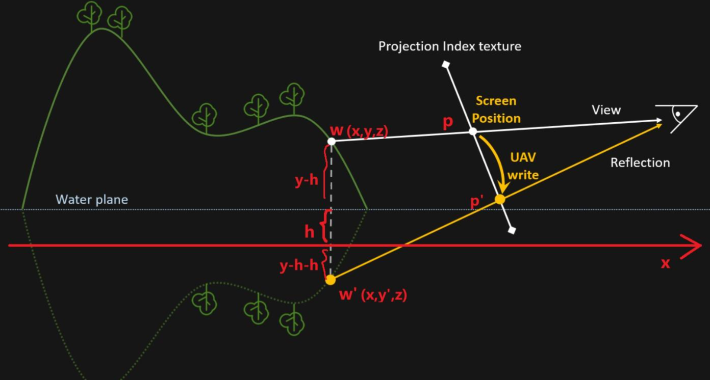
            >  *(上图引用自思维导图附件)*
        - SSR
        - Planar Reflection
      - 环境光镜面反射
      >  *屏幕空间镜面
反射项a通道插值*
        - 间接光镜面反射值
    - 散射
      - 屏幕空间散射
        - 这里忽略了间接光的散射项，即屏幕空间颜色本身会发生散射
      - 浅水散射
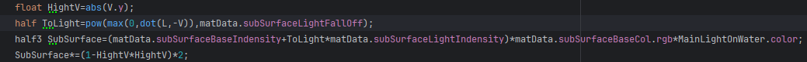
        >  *(上图引用自思维导图附件)*
### 水体渲染
    - 交互
      - **波动方程**
        - **未命名分组**
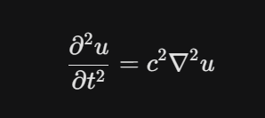
          >  *(上图引用自思维导图附件)*
          - **未命名分组**
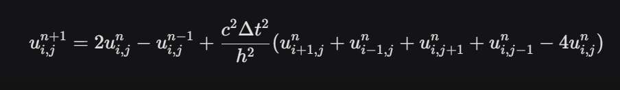
            >  *(上图引用自思维导图附件)*
            - **未命名分组**
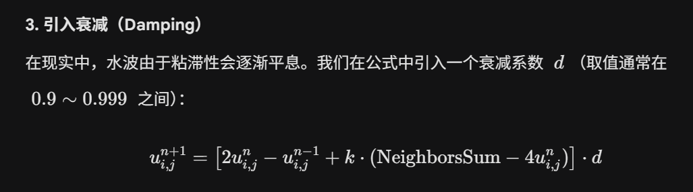
              >  *(上图引用自思维导图附件)*
### 波形概述
#### Gestner波
#### Fbm(分形噪声）
#### Gestner波概述
##### offset.x += steepness * amp * dir.x * cos(Phase) 

offset.z += steepness * amp * dir.y * cos(Phase) 

offset.y += amp * sin(Phase)
- $$Phase = \text{dot}(\vec{Direction}, \vec{Position}.xz) \times Freq + Time \times Speed$$
##### 顶点位移
##### normal.x -= dir.x * freq * amp * cos(Phase) 

normal.z -= dir.y * freq * amp * cos(Phase) 

normal.y -= steepness * freq * amp * sin(Phase)
##### 法线解析式
##### 雅可比矩阵
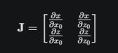
        >  *(上图引用自思维导图附件)*
##### 牛顿迭代法
        - guessedOrigin = guessedOrigin + (TargetPos - CalculatedPos)
##### Gerstner波原理
###### 基于三角函数，在y轴位移的基础上，进行xz方向的位移，以实现挤压得效果，简单来说，当sin(x)最大时，cos（x)左右都会向x这一横坐标挤压
#### Fbm概述
##### 网格顶点随机值-》局部坐标-》平滑函数-》双线性插值
##### ValueNoise
##### NoiseType
        - PerlinNoise
          - 网格顶点随机向量-》局部坐标-》采样点与网格顶点向量点乘-》平滑函数-》双线性插值
- $$f(t) = t$$
##### 插值方法（C1，C2,C3连续）
- $$f(t) = 3t^2 - 2t^3$$
- $$f(t) = 6t^5 - 15t^4 + 10t^3$$
### 波动方程
#### 空间确定
      - **虚拟俯视视角相机空间**
#### 空间映射
      - **相邻时间间隔RTUV偏移**
        - **未命名分组**
          - DeltaUV and DeltaUVprev
          - DeltaUV：世界空间坐标DeltaDistance-》UV空间Delta-》正确写入相对位置
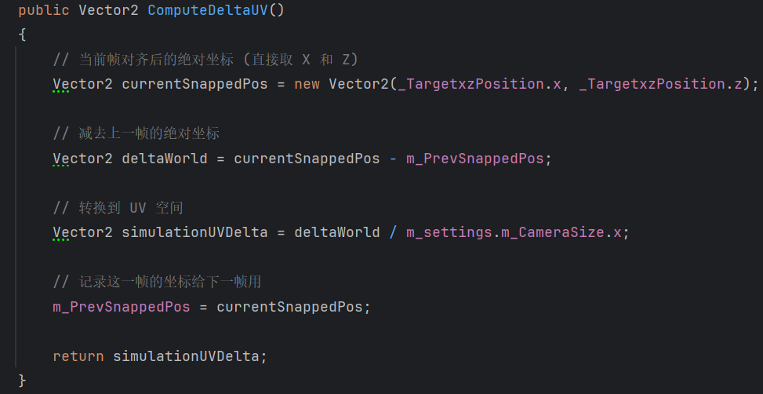
          >  *(上图引用自思维导图附件)*
#### 帧同步
#### 数学原理
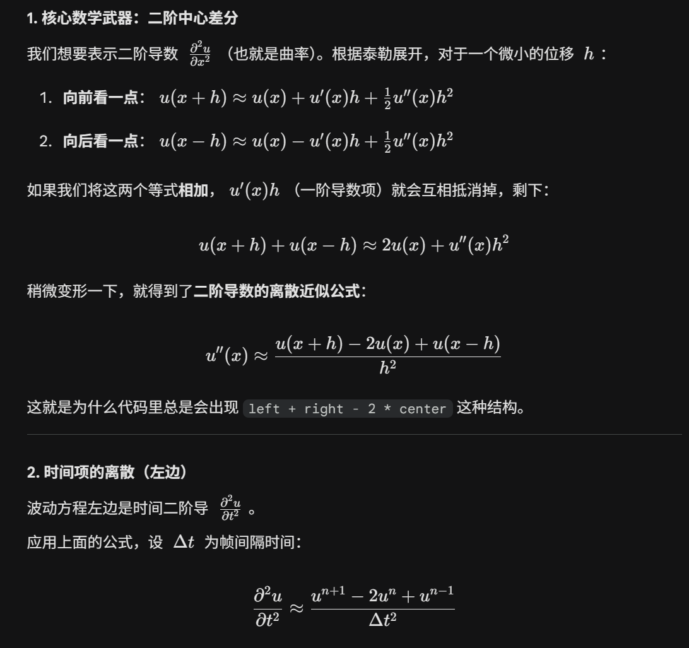
#### 数据流梳理
##### 主要数据：WaveRT（before current next)
DepthDifferenceRT
##### C#
###### 计算当前帧的摄像机空间世界偏移-》
RT相对的UV偏移+
上一帧记录的PrevUV偏移
      >  *UV偏移属性*
        - **CS**
          - 此时我们需要更新最新位移导致的下一帧RT-》(WaveRT)
利用uv偏移定位到当前帧RT与上一帧RT的相同世界空间位置的采样点
          - **未命名分组**
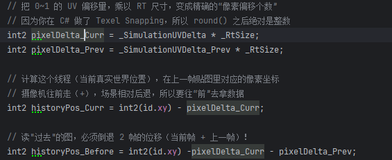
            >  *(上图引用自思维导图附件)*
        - **CS**
          - 此时我们需要判断摄像机空间是否产生了冲量-》(DepthDifferenceRT)
利用uv偏移定位到当前帧RT相同世界空间位置的深度采样点进行对比
          - **未命名分组**
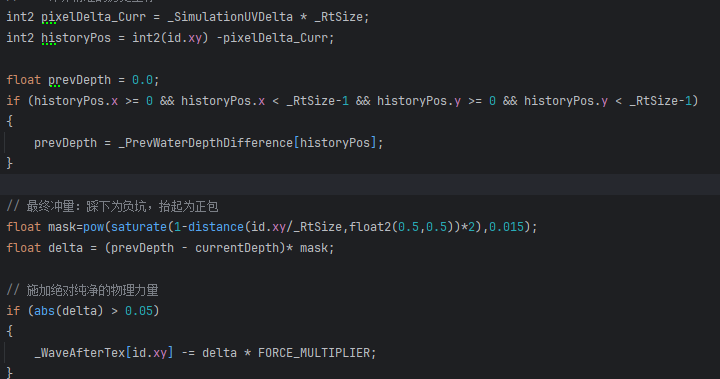
            >  *(上图引用自思维导图附件)*
##### 目的
###### 1.正确更新世界空间同一位置的波动方程RT
2.正确识别ForceInput（动态物体）
#### 摄像机空间对齐
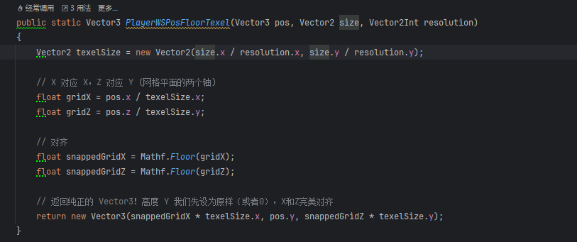
##### 原理：Bilinear过滤模式RT（我们可以白嫖双线性过滤）
但是在动态空间微小的摄像机偏移会造成“过滤效果的扩散”-》
故我们之后需要的位置偏移UV需要去对齐到cameraSize/texResolution
#### 确定时间间隔进行更新...
##### 原理：积累隔帧DeltaUV
##### 确定时间间隔进行更新波动方程RT图
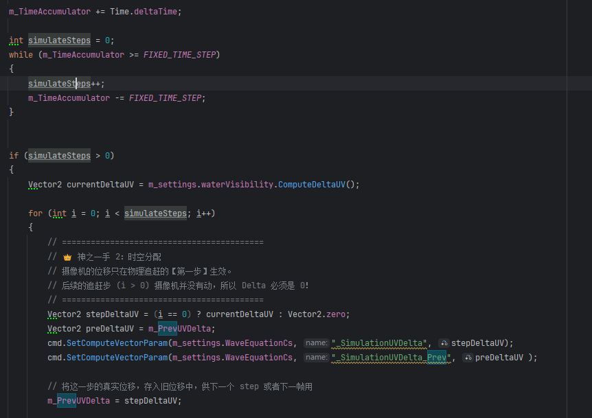
### 间接光折射
#### 空间映射逻辑
##### float DistancetoWater = (_CausticsPlaneHeight - posWSfromShadowmap.y) / -mainLightDir.y;
    float3 posWaterWS = posWSfromShadowmap.xyz + DistancetoWater * (float3)-mainLightDir;
##### CS中将Shadowmap转到世界空间确定水面起点（OriginalPos）
##### OriginalPos-》LightSpace(准备步进）
##### 空间映射逻辑
        - C# 建立光源空间-》世界空间 矩阵数组与逻辑
          - 获取主光对象
            - 获取主光信息
              - ShadowmapWidth
                - 循环级联数量
                  - API:renderingData.cullResults.ComputeDirectionalShadowMatricesAndCullingPrimitives
                    - View ,projMatrix
                      - 构建矩阵数组
              - shadowNearPlane
          - 获取级联数量
##### C# 建立光源空间-》世界空间 矩阵数组与逻辑
###### NDC Matrix (-1,1->0,1)
###### UV偏移矩阵
          - **级联分布逻辑**
            - case 1:
                                // 1 级：占满整张图
                                scale = new Vector2(1.0f, 1.0f);
                                offset = new Vector2(0.0f, 0.0f);
                                break;

                            case 2:
                                // 2 级：左右对半分 (X 轴缩放一半，Y 轴拉满)
                                scale = new Vector2(0.5f, 1.0f);
                                offset = new Vector2(i * 0.5f, 0.0f); // i=0 在左，i=1 在右
                                break;

                            case 3:
                            case 4:
                            default:
                                // 4 级 (或 3 级)：2x2 田字格
                                scale = new Vector2(0.5f, 0.5f);
                                offset = new Vector2((i % 2) * 0.5f, (i / 2) * 0.5f);
                                break;
#### 色散效果
#### 相邻级联插值
##### 下一级联等级焦散值
##### 全局属性：级联矩阵数组
##### 全局属性：级联球范围位置+级联球半径（通过级联等级判断）
#### 光线步进
### 间接光镜面反射
#### 屏幕空间镜面反射
##### SSPR原理
        - VP_Inverse矩阵转世界坐标
        - 条件判断-》水下水上
          - 水上水下a通道不相同：
方便之后对于水上水下
SSPR进行区分，并且>0.5(保证Fill hole Kernel效果有效）
        - 高度图原子对比与写入
InterlockedCompareExchange(_SSPRHeightTexture[idx], oldHeight, newHeightU, prev);
          - uint oldHeight = _SSPRHeightTexture[idx];
while (newHeightU < oldHeight) 
{
    InterlockedCompareExchange(_SSPRHeightTexture[idx], oldHeight, newHeightU, prev);
    if (prev == oldHeight)
    {
        _SSPRTexture[idx] = half4(Color, 1); // 成功竞争到最小深度，写入颜色
        break;
    }
    oldHeight = prev; // 竞争失败，拿最新的值（其他线程写入的值，也就是该线程的原始值）继续比
}
        - FillHole
          - 原理：由于投影变换后空间为非正交空间
故会在sspr时会因为实像与虚像的RT面积
（导致实像的信息不够）不等，导致虚像
（SSPR）得到的图像有空隙
            - 解决方案：由于我们的sspr逻辑没有信息的虚像的a通道不会被写入为1，
我们只需要获取相邻空间a！=0的像素点
        - Kawase模糊
          - 中心像素的上下左右
          - 循环扩大核大小+pingpong
##### SSPR流程
#### 环境光镜面反射
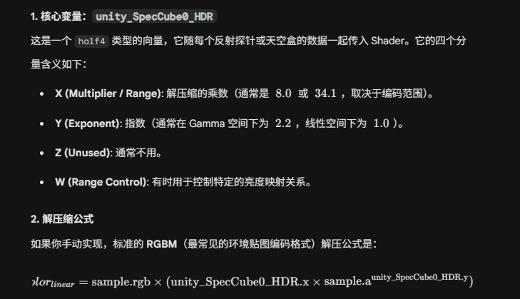
##### 属性绑定（环境光相关项为UnityPerDraw Cbuffer)：
materialPropertyBlock.SetTexture("unity_SpecCube0",ReflectionProbe.defaultTexture);
materialPropertyBlock.SetVector("unity_SpecCube0_HDR",ReflectionProbe.defaultTextureHDRDecodeValues);
### 散射
#### 美术友好的拟合：
finalColor=屏幕空间颜色*rampColor*ramp.a+ramp.rgb*(1-a)
#### 原理：最终颜色=吸收项+内散射项=屏幕空间颜色*BeerLambert+各项异性的散射

## 计算阶段与几何阶段（曲面细分）
### 切分
    - StructuredList
    >  *StructuredBuffer*
      - CS按距离四叉树无限切分（迭代法）
        - 原理:position->position+=offset
size/=2;
        - **对应代码**
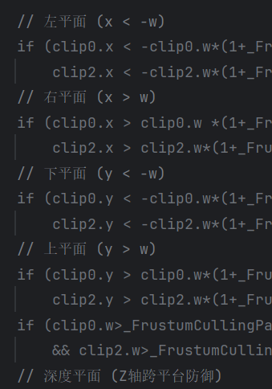
          >  *(上图引用自思维导图附件)*
### CPU粗粒度切分与剔除
    - 剔除
### 水体网格的生成逻辑
    - **曲面细分着色器的按距离细分**
      - Edge TessFactor
      >  *对边Factor/2*
        - inter TessFactor
      - ConstantHullShader
        - Tessellator
          - Domain Shader
            - **属性插值与顶点位移**
              - **未命名分组**
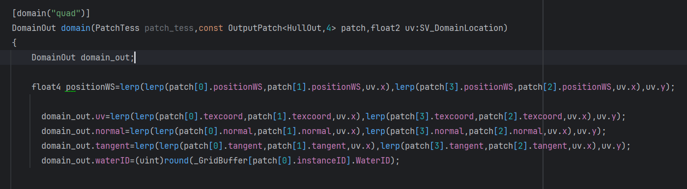
                >  *(上图引用自思维导图附件)*
      - **ControlPoint HullShader**
        - 仅进行SV_OutputControlPoint传递
          - **代码**
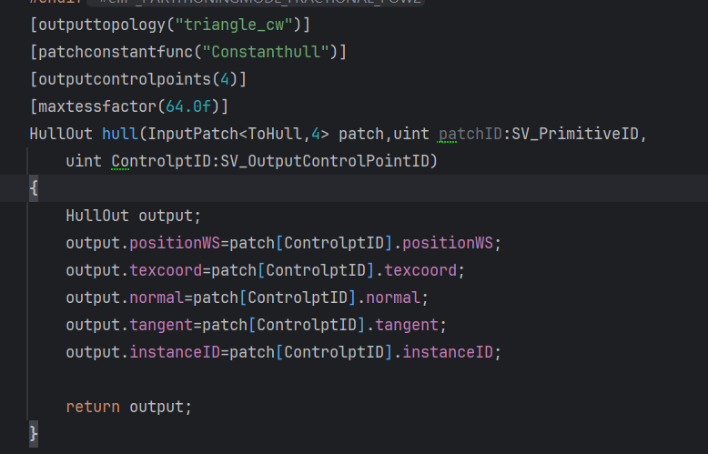
            >  *(上图引用自思维导图附件)*
### 距离细分因子计算函数
#### 未命名分组
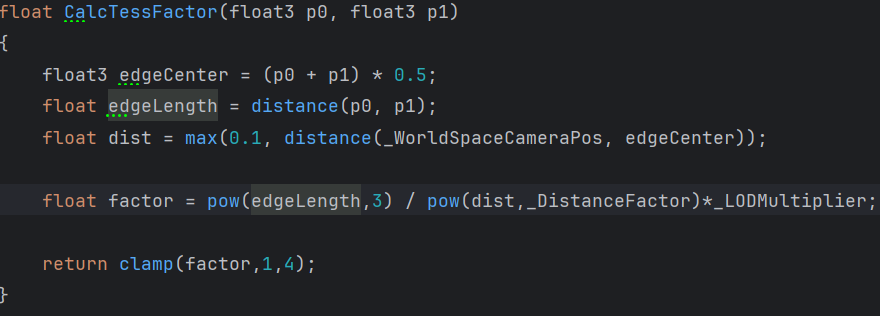
      - **公式原理**
        - 	在选择Fraction_even和Fraction_odd的细分模式的过程中，前者的偶数细分特征十分适配切分四叉树的规则，这里可将Fraction_even模式描述为：细分因子值为0-2拓扑结构不变；2-3生成新的点与线段但保持位置不变；3-4平滑到对称位置。
	故我们在设计切分细分函数时只需要相邻边切分（细分）返回值的比值关系<=1/4并且避免极端情况（面片各边缘的切分逻辑返回结果过于迥异）导致的相邻边的切分状态跳变

pow(1/2*edgelength,3)=1/8*pow(edgelength,3)
这里设置为3-》弥补Dist在该式中有差异的缺陷
#### Fractional_even与Fractional_odd
##### Fractional_even:细分因子当<=2时被视为2（被至少切分为2格）
当细分因子>=2时，产生新顶点且=4时，完成平滑移动，之后每
逢2生成新顶点且平滑移动到对称位置
##### Fraction_odd:细分因子每逢2x-1进行新顶点生成
且平滑移动到对称位置
### 切分
### 剔除
#### 原理
##### 裁剪空间-NDC空间,通过w进行齐次空间到非齐次空间的转换(/w),此时x,y=>(-1,1)
z<(0,1)
        - 裁剪空间为齐次空间的原因(保证我们可以始终只需要矩阵去进行空间转换):
1.裁剪空间实际上为中间的过渡空间
2.xyz需要转换到0-1,其条件需要xyz的z本身(相似三角形原理)
3.我们需要分为两步转换为NDC空间,其一为先建立公式,其二
为将z提出来,通过齐次裁剪空间矩阵的43位置设为1,将结果向量的w分量设为-z
### 波形数据优化
#### 波形数据优化
      - Before
        - 焦散Pass/本Pass顶点阶段/本Pass片元着色器阶段/水线Pass重复计算Gerstner波
以及重复采样波动方程RT
      >  *Clipmap*
        - After
          - 仅采样Clipmap
          - **未命名分组**
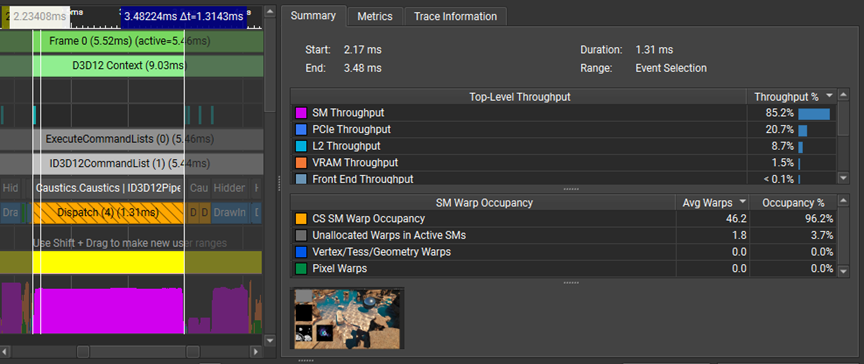
            >  *(上图引用自思维导图附件)*
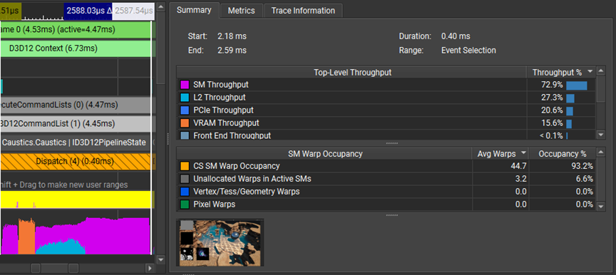
            >  *(上图引用自思维导图附件)*
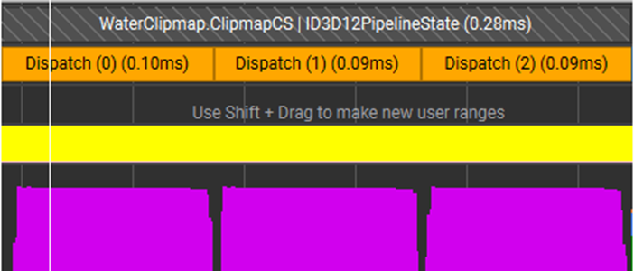
            >  *(上图引用自思维导图附件)*

## 应用阶段(Draw Call与衔接计算阶段）
### MaterialParamBuffer（structuredbuffer）
    - **未命名分组**
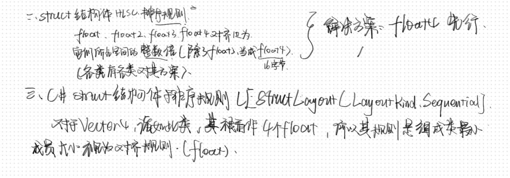
      >  *(上图引用自思维导图附件)*
### GridBuffer（structuredbuffer）
    - **数据来源**
      - 计算阶段：pingpong类迭代循环逻辑进行四叉树切分
        - 切分条件满足
          - 写入pong-Buffer并进入下一轮切分判断
        - 不满足切分条件
          - 写入final-gridbuffer，并countbuffer[0]+=1（原子）
          >  *countbufferValue*
            - 写入bufferWithargs[1]
      - 间接参数缓冲区
### 属性绑定
    - PerDrawParam
      - **RampTextureArray构建**
        - C#Gradient对象
          - **未命名分组**
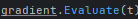
            >  *(上图引用自思维导图附件)*
            - new TextureArray（写入相应切片-与materialparambuffer下标对应）
              - Texture.Apply
        - **过程解构**
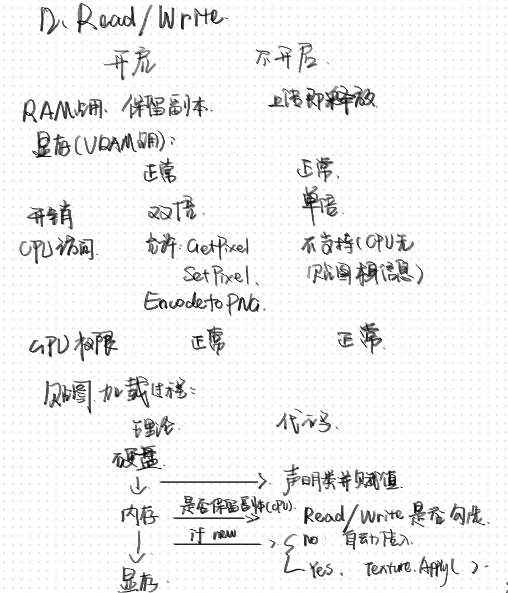
          >  *(上图引用自思维导图附件)*
    - 新节点
### DrawMeshInstancedIndirect
### HLSL结构体与C#结构体对齐
### 格式
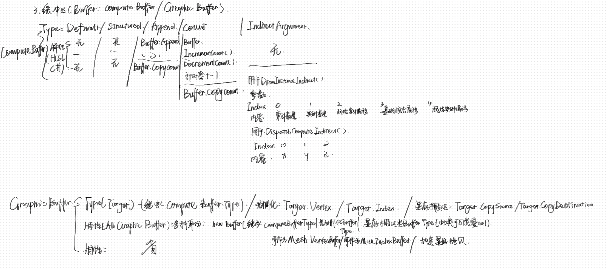

## 其他Pass
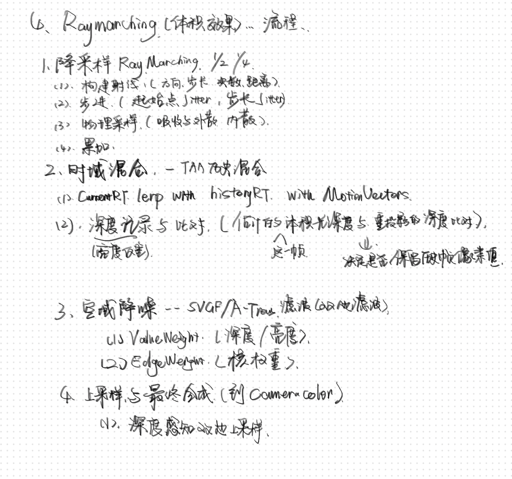
### 基于焦散级联图
### 体积光
### 水线mask
    - 水下散射
      - 仅屏幕空间的依据深度的拟合吸收效果（与水面的逻辑完全相同）
        - **GrabDepthTargetRThandle+GrabColorTargetRThandle**
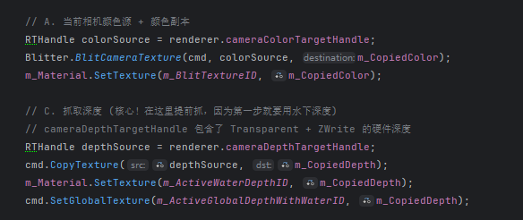
          >  *(上图引用自思维导图附件)*
    - **水线效果**
      - Gerstner波位移数据
        - 水面Height数据
        >  *牛顿迭代法*
          - 水波的相应xz的y值
            - 距离差
              - 根据距离差大小的屏幕RT扭曲
                - 模糊
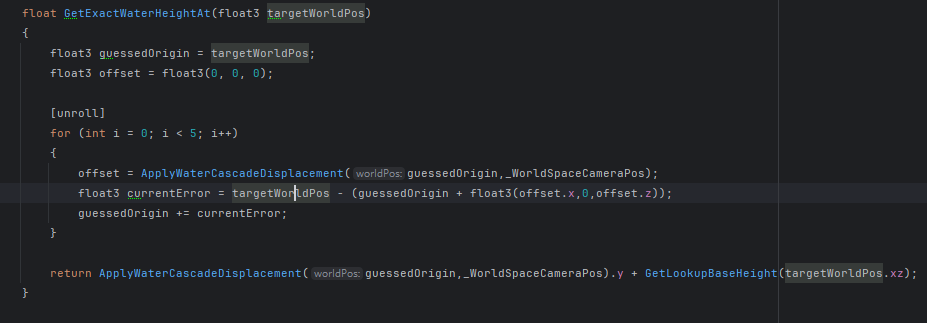
      >  *(上图引用自思维导图附件)*
      - 这里我们是特殊化，我们需要近平面的世界坐标
      - **屏幕坐标-》世界坐标（逆矩阵法）**
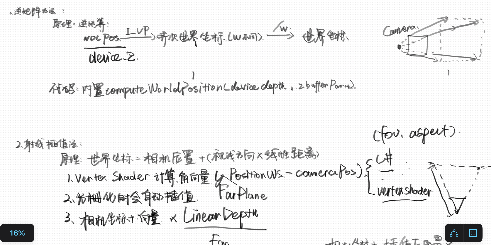
        >  *(上图引用自思维导图附件)*
### 水下部分（动态mask）
### 后处理阶段
    - 岸边部分（静态水面高度mask）
### 当我们Grab两者时，我们才能根据深度做出正确的Ramp插值（水面写入深度）

## ...

## ...

## ...
